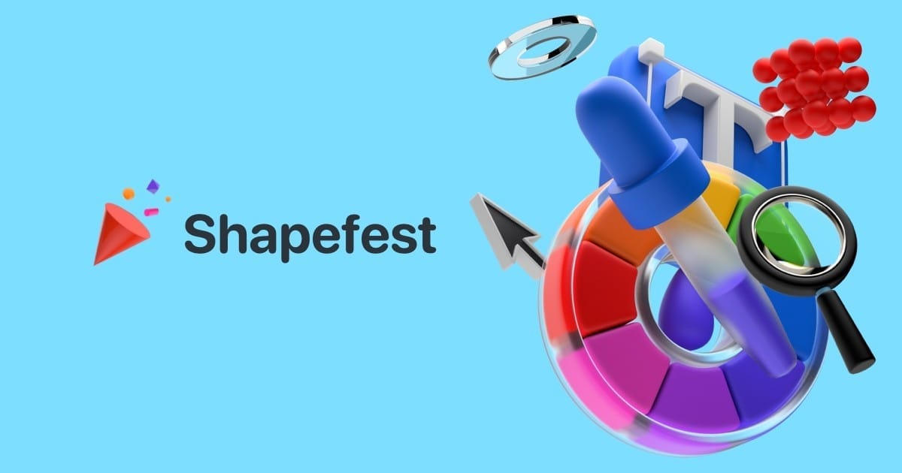
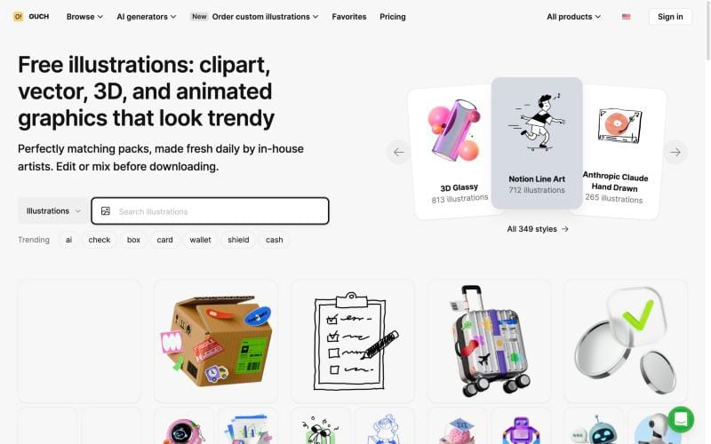
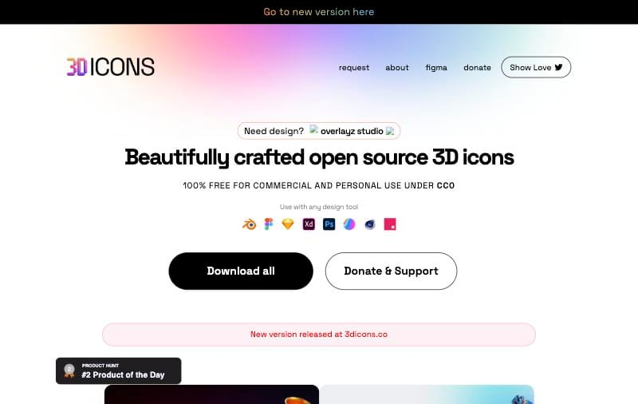
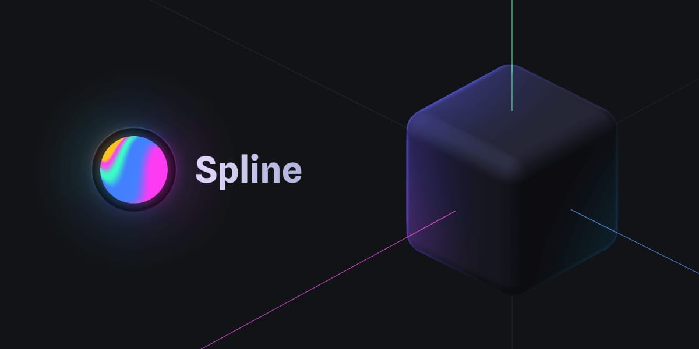
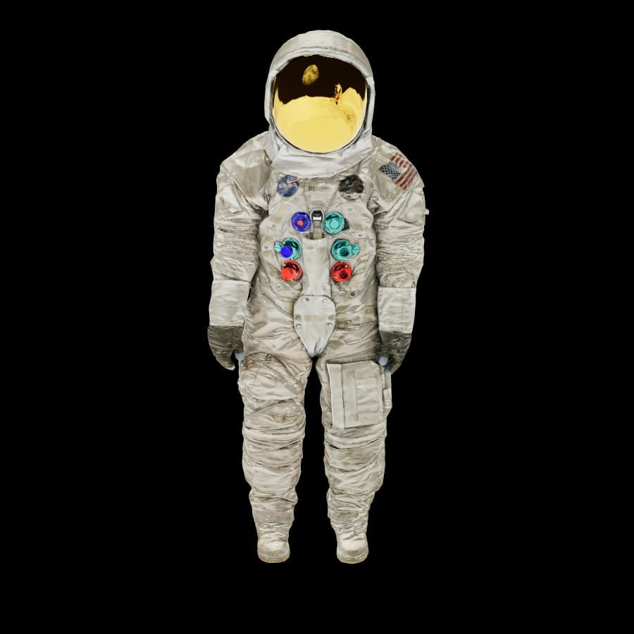
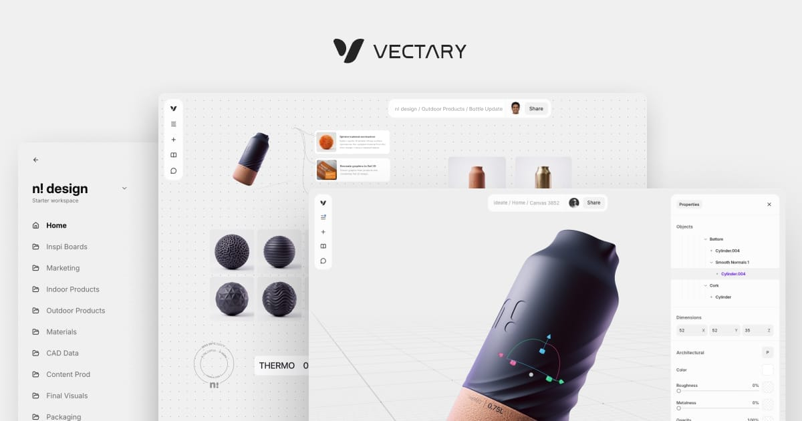
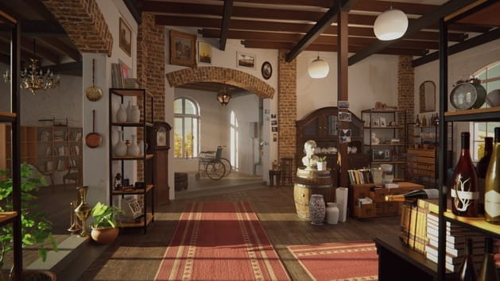
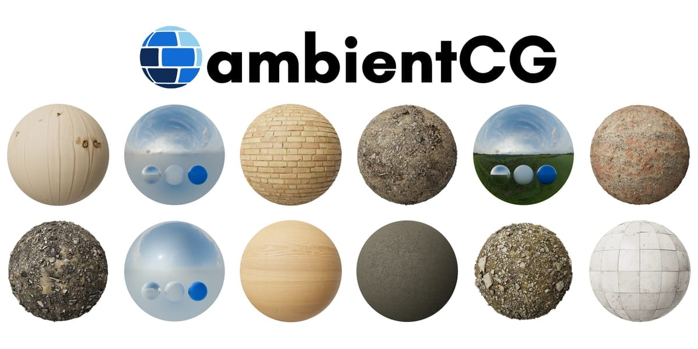
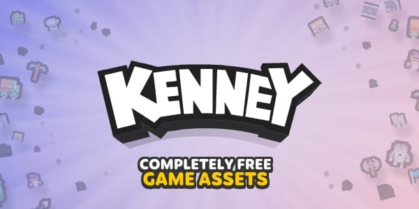

Most pages that use 3D only need a picture of something 3D. Fewer need an object that rotates. Very few need a full scene built from models, textures and lighting. Each step up costs more in production time, file size and performance.

Start at the lowest level that does the job.

Price tags: Free fully free. Free + paid usable for free, with a paid tier that adds more. Prices as of October 2026.

## Level 1: pre-rendered 3D images

A render exported as PNG or WebP loads like any other image. No runtime, no extra JavaScript.

- 
  **[Shapefest](https://shapefest.com/)** Free + paid\
  100,000+ ray-traced shapes and objects. Free downloads are 512×512 px; paid tiers go to 3000×3000 px.\
  **Use when:** you need abstract 3D accents.
- 
  **[Icons8 illustrations](https://icons8.com/illustrations)** Free + paid\
  Hundreds of styles, many in 3D, in consistent packs. Free use needs a link back; paid removes it and adds high resolution.\
  **Use when:** a whole page needs one consistent style.
- 
  **[3dicons](https://old.3dicons.co/)** Free\
  120 icons in four colour styles and three camera angles. CC0, no attribution. A newer version lives at 3dicons.co.\
  **Use when:** you need 3D icons for features or empty states.

Covers feature illustrations, hero images and decorative accents. Compress before shipping: soft shadows and gradients compress well to WebP or AVIF.

## Level 2: interactive 3D

When the user should rotate, zoom or trigger something, the page needs a 3D runtime.

- 
  **[Spline](https://spline.design/)** Free + paid\
  Browser 3D design tool with states, events and animation. Exports as embed, React component or code.\
  **Use when:** designing an interactive object from scratch.
- 
  **[`<model-viewer>`](https://modelviewer.dev/)** Free\
  Google web component for glTF/GLB models, with orbit controls and AR on supported phones. One HTML tag.\
  **Use when:** the model already exists.
- 
  **[Vectary](https://www.vectary.com/)** Free + paid\
  Browser 3D tool focused on product visualisation, configurators and AR.\
  **Use when:** building a product configurator.

Interactive 3D has a real cost. Check load size on a mid-range phone, provide a static fallback image, and keep heavy scenes out of the first screen.

## Level 3: assets for building a scene

When a scene is built in Blender, Three.js or a game engine, it needs raw materials. All three sources below are CC0, so there are no licensing questions for commercial work.

- 
  **[Poly Haven](https://polyhaven.com/)** Free\
  HDRIs, textures and models. One good HDRI gives realistic lighting without placing lights by hand.\
  **Use when:** lighting looks flat.
- 
  **[ambientCG](https://ambientcg.com/)** Free\
  PBR materials (wood, metal, fabric, stone) with the full set of maps.\
  **Use when:** surfaces need realistic materials.
- 
  **[Kenney](https://kenney.nl/assets)** Free\
  Thousands of game assets: low-poly models, sprites, UI and sound.\
  **Use when:** prototyping or building a stylised scene.

## Choosing the level

| The page needs | Level | Start with | Price |
|---|---|---|---|
| A 3D look, nothing moves | 1 | Shapefest, 3dicons | Free |
| An object the user can rotate | 2 | `<model-viewer>` | Free |
| An interactive designed scene | 2 | Spline | Free + paid |
| A custom scene in Three.js or Blender | 3 | Poly Haven, ambientCG | Free |
| A stylised prototype or game | 3 | Kenney | Free |

The test for each page: what does the user get from interacting with this object that a still image would not give them. If there is no specific answer, level 1 is the right level.
