A new site needs five layers before layout work starts: components, colour, type and spacing, icons, and imagery. The risk is not picking a bad source. It is mixing three good ones that were never designed to sit together.

The rule here: one source per layer. Add a second only when the first has a real gap.

Price tags: Free fully free. Free + paid usable for free, with a paid tier that adds more. Prices as of October 2026.

## Components

Pick one base library. Two in one codebase means two definitions of a button.

- 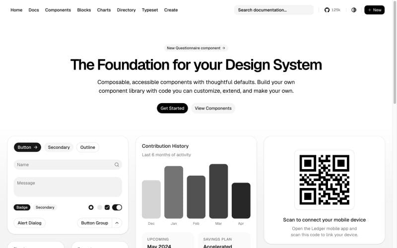
  **[shadcn/ui](https://ui.shadcn.com/)** Free\
  Copies component source into the project. Built on Radix and Tailwind.\
  **Use when:** you want to own and edit every component.
- 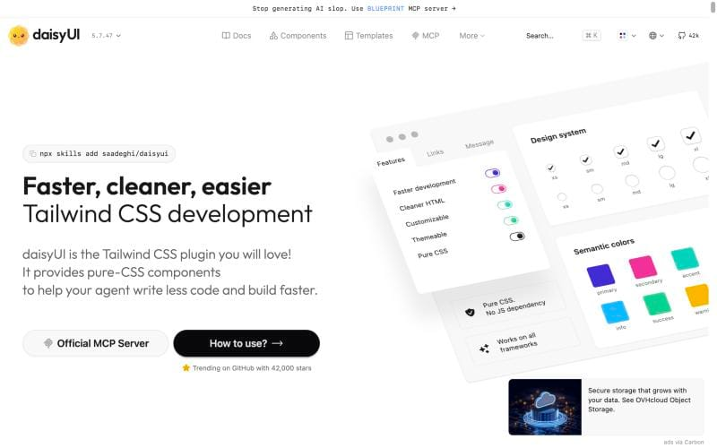
  **[daisyUI](https://daisyui.com/)** Free\
  Tailwind plugin with class-based components. Pure CSS, works with any framework.\
  **Use when:** you want components without React.
- 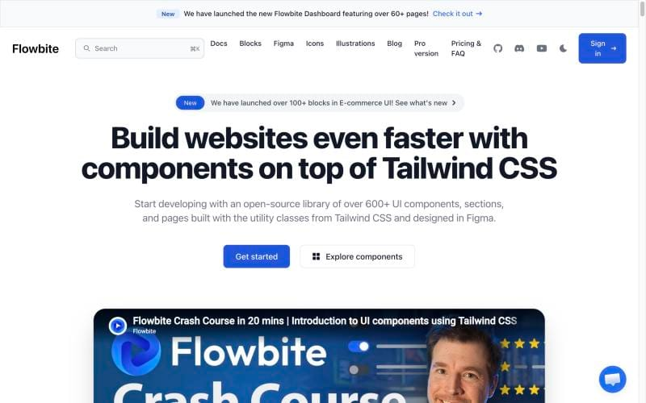
  **[Flowbite](https://flowbite.com/)** Free + paid\
  600+ Tailwind components with a matching Figma kit. Pro adds more blocks.\
  **Use when:** design and code need the same kit.

**Pick:** shadcn/ui for React projects.

## Blocks and effects

Ready-made sections save the most time on marketing pages. Effects work for one or two moments per page, not as the base layer.

- 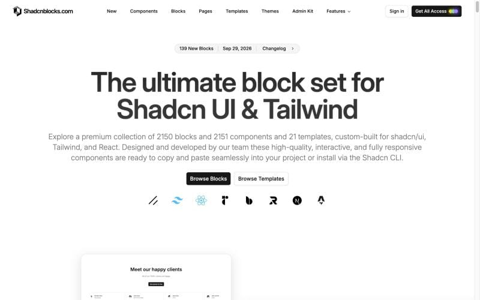
  **[shadcnblocks](https://www.shadcnblocks.com/)** Free + paid\
  Headers, pricing tables, FAQs built on shadcn/ui. Most of the library is paid.\
  **Use when:** you need a full section fast.
- 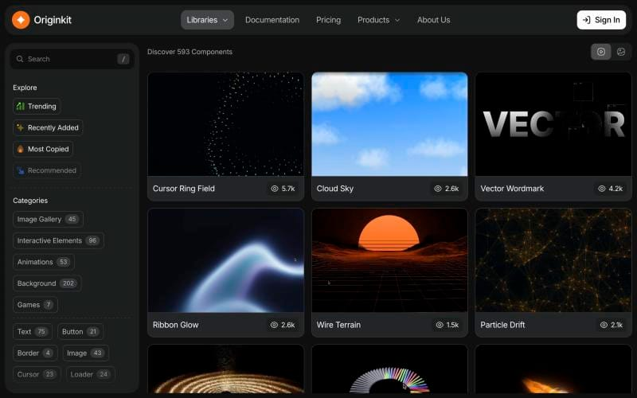
  **[Originkit](https://www.originkit.dev/)** Free + paid\
  Animated sections and backgrounds. Free tier caps daily copies.\
  **Use when:** a section needs motion built in.
- 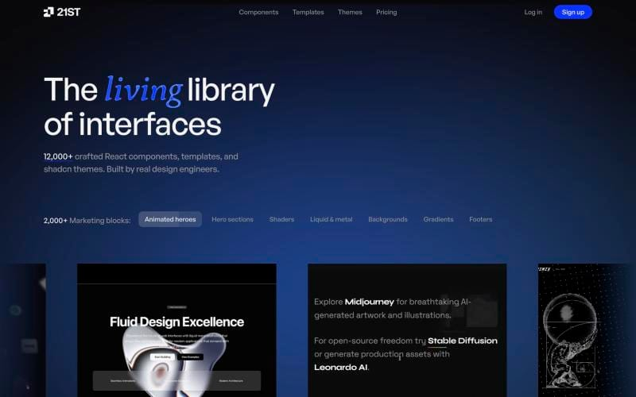
  **[21st.dev](https://21st.dev/)** Free + paid\
  Community components, each with a prompt for AI coding tools.\
  **Use when:** you build with Cursor, Claude or similar.
- 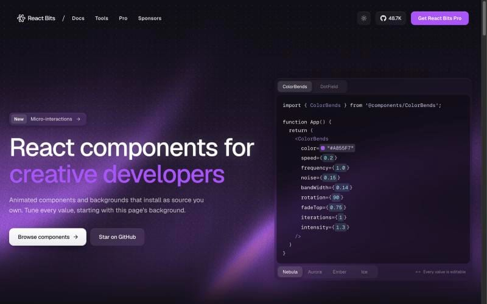
  **[React Bits](https://reactbits.dev/)** Free + paid\
  Animated text, backgrounds and components for React.\
  **Use when:** a hero needs one striking effect.
- 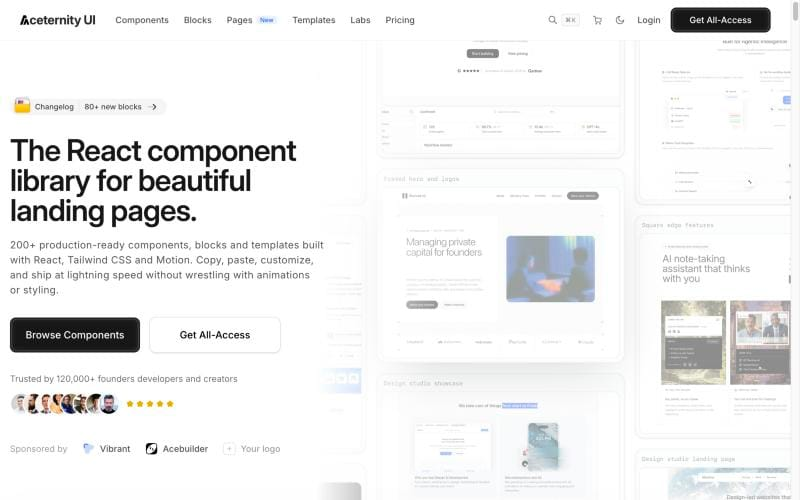
  **[Aceternity UI](https://ui.aceternity.com/)** Free + paid\
  Cards, backgrounds and landing page blocks with Motion.\
  **Use when:** a landing page needs polish quickly.
- 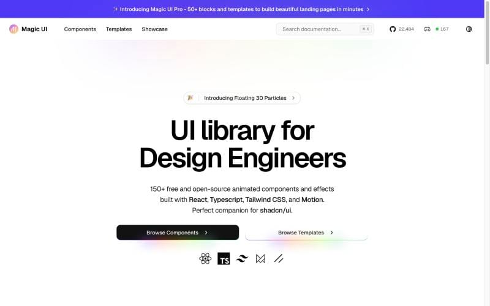
  **[Magic UI](https://magicui.design/)** Free + paid\
  150+ animated components, designed to sit next to shadcn/ui.\
  **Use when:** you already use shadcn/ui.
- 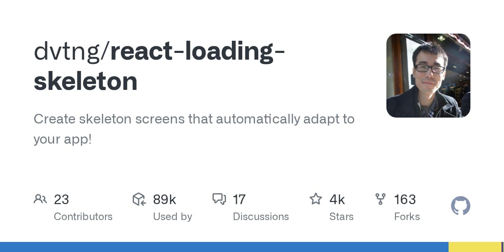
  **[react-loading-skeleton](https://github.com/dvtng/react-loading-skeleton)** Free\
  Placeholder shapes while data loads, so the page does not jump.\
  **Use when:** you are not on shadcn/ui, which has its own Skeleton.

**Pick:** shadcnblocks for sections, one effects library at most.

## Colour

Explore with a generator. Ship with a scale.

- **[Coolors](https://coolors.co/)** Free + paid\
  Generate and lock palettes one colour at a time.\
  **Use when:** exploring brand colours.
- 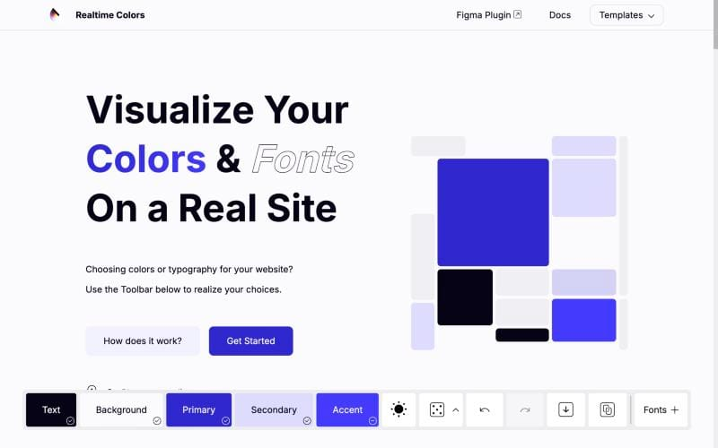
  **[Realtime Colors](https://www.realtimecolors.com/)** Free\
  Previews a palette and fonts on a real page layout.\
  **Use when:** checking contrast and balance before committing.
- 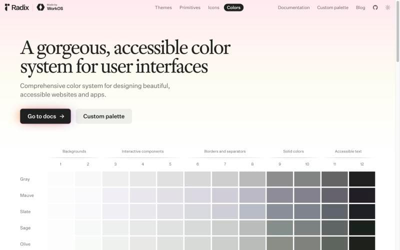
  **[Radix Colors](https://www.radix-ui.com/colors)** Free\
  12-step scales where each step has a job, with matching dark scales.\
  **Use when:** building tokens for production.

**Pick:** Radix Colors. Semantic tokens point at steps, not hex values, which survives a rebrand.

## Fonts

- 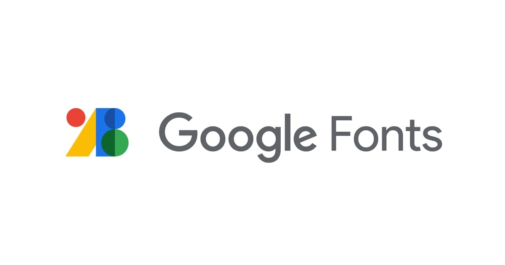
  **[Google Fonts](https://fonts.google.com/)** Free\
  The largest free library, hosted.\
  **Use when:** you need range and reliability.
- 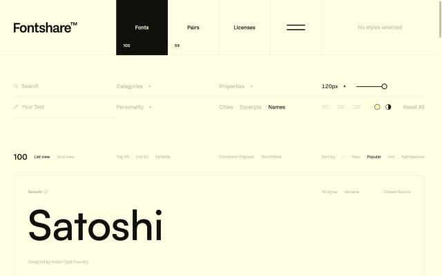
  **[Fontshare](https://www.fontshare.com/)** Free\
  A smaller set of free, more distinctive faces.\
  **Use when:** Google Fonts feels generic.
- **[Typewolf](https://www.typewolf.com/)** Free\
  Which fonts real sites use, and which pairings hold up.\
  **Use when:** choosing a pairing.

## Type scale and spacing

Six to eight sizes cover most sites. More usually means one-off fixes.

- 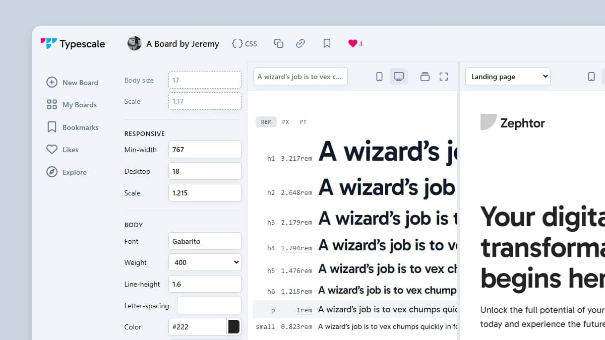
  **[Typescale](https://typescale.com/)** Free\
  Fixed scale from a base size and a ratio.\
  **Use when:** a fixed scale is enough.
- 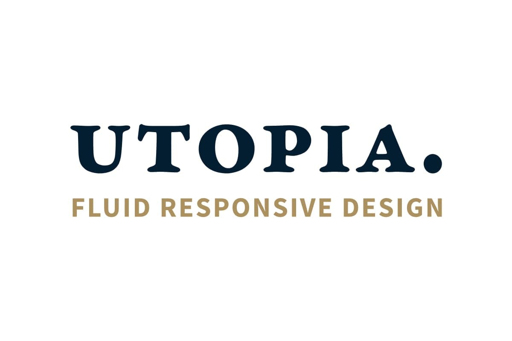
  **[Utopia](https://utopia.fyi/)** Free\
  Fluid type and spacing with CSS `clamp()`. No breakpoint jumps.\
  **Use when:** the site must scale smoothly across viewports.
- 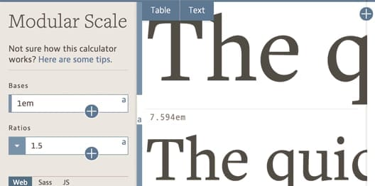
  **[Modular Scale](https://www.modularscale.com/)** Free\
  The original ratio-based scale calculator.\
  **Use when:** you want to compare ratios side by side.

**Pick:** Utopia.

## Theme for shadcn/ui

shadcn/ui reads its theme from CSS variables. Any of these outputs that block; edit by hand afterwards.

- 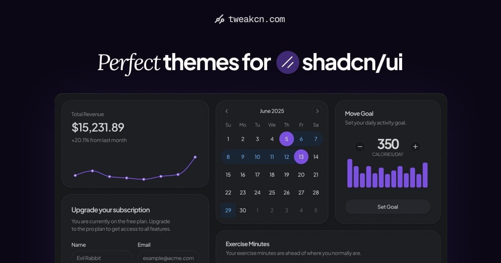
  **[tweakcn](https://tweakcn.com/editor/theme)** Free + paid\
  Visual editor with live previews and a contrast checker. Pro ($8/month) adds unlimited AI themes.\
  **Use when:** you want to see every component while tuning.
- 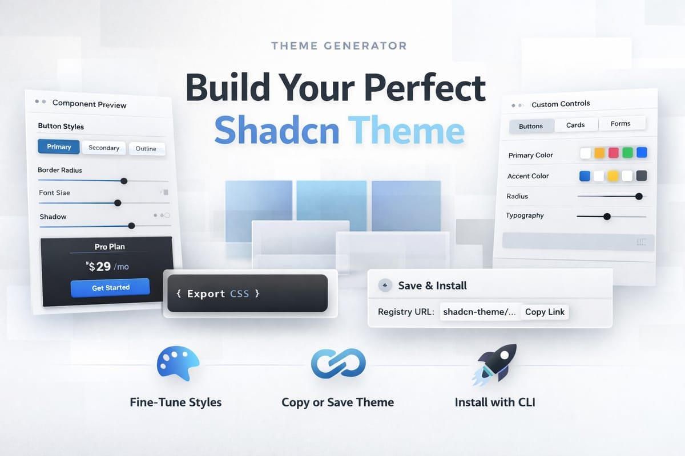
  **[ZippyStarter generator](https://zippystarter.com/tools/shadcn-ui-theme-generator)** Free\
  Generates a full theme from a starting colour.\
  **Use when:** you have one brand colour and nothing else.
- 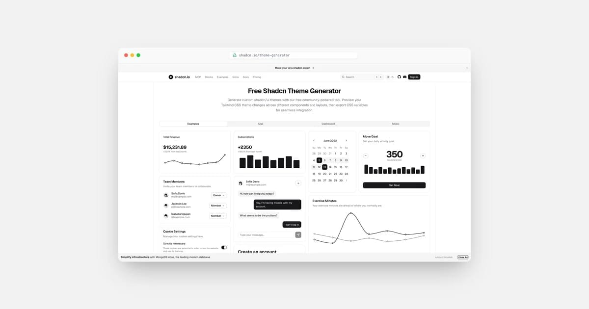
  **[shadcn.io generator](https://www.shadcn.io/theme-generator)** Free\
  Community theme generator with component previews.\
  **Use when:** you want to start from someone else's theme.

**Pick:** tweakcn on the free tier.

## Icons

One icon set per product. Mixing shows in stroke width and corner radius.

- 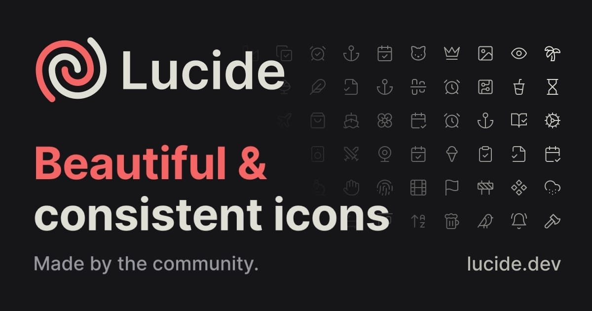
  **[Lucide](https://lucide.dev/icons/)** Free\
  Default icon set for shadcn/ui.\
  **Use when:** you are on shadcn/ui.
- **[Phosphor](https://phosphoricons.com/)** Free\
  Six weights per icon, from thin to fill.\
  **Use when:** one set must serve dense tables and large headers.
- 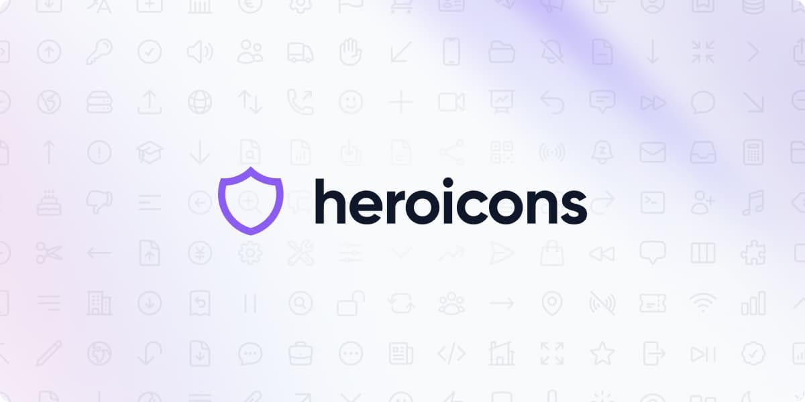
  **[Heroicons](https://heroicons.com/)** Free\
  Smaller set from the Tailwind team.\
  **Use when:** you need the basics and nothing more.

**Pick:** Lucide.

## Illustrations and backgrounds

- 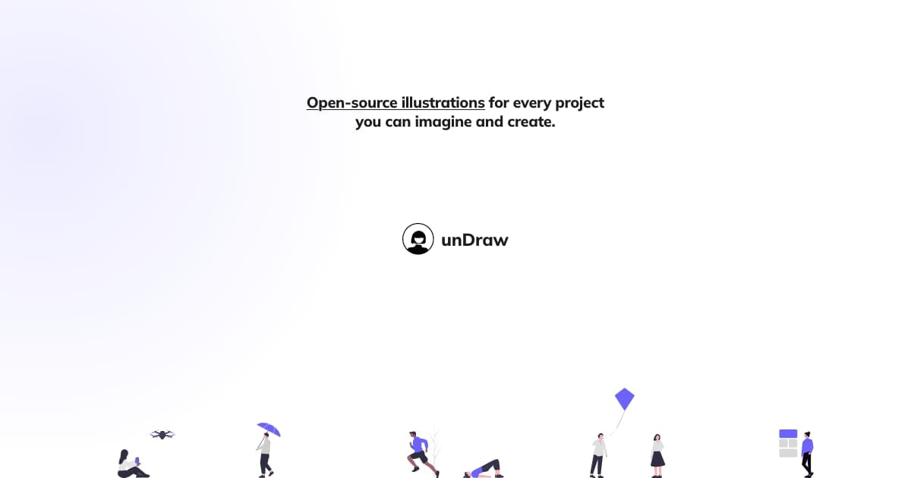
  **[unDraw](https://undraw.co/illustrations)** Free\
  Set an accent colour before download.\
  **Use when:** illustrations must match the palette.
- 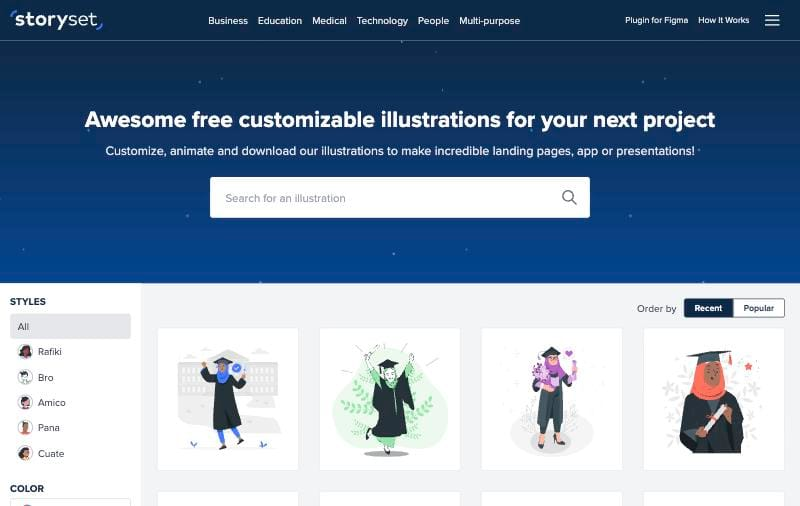
  **[Storyset](https://storyset.com/)** Free\
  Several styles per scene, can be animated. Free use needs attribution.\
  **Use when:** you want motion in illustrations.
- 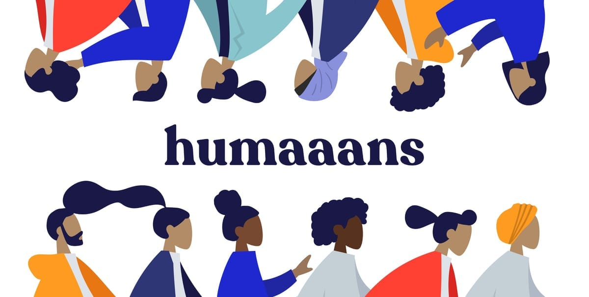
  **[Humaaans](https://www.humaaans.com/)** Free\
  Mix-and-match people.\
  **Use when:** you need people in many poses.
- 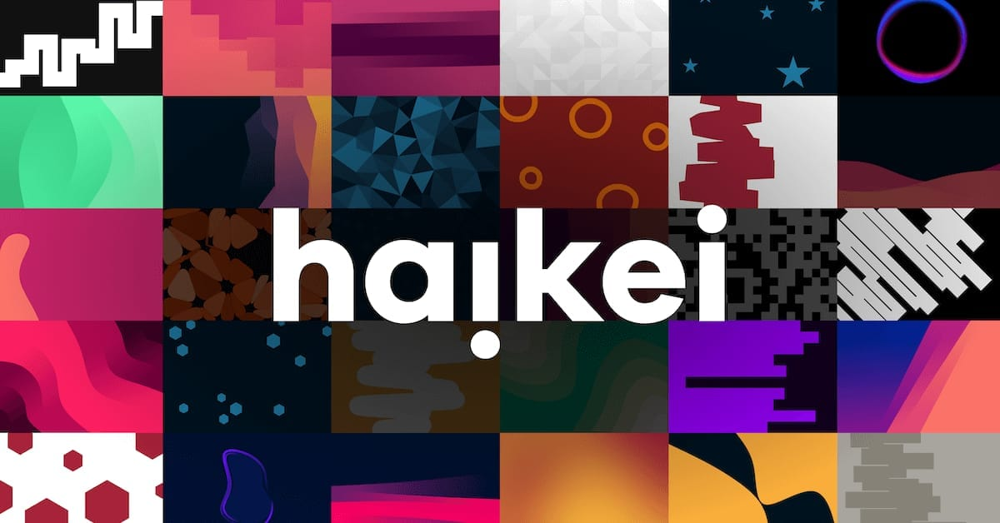
  **[Haikei](https://haikei.app/)** Free\
  Generates SVG waves, blobs and layered shapes.\
  **Use when:** a section needs a background shape.
- **[SVGBackgrounds](https://www.svgbackgrounds.com/)** Free + paid\
  Ready-made SVG patterns.\
  **Use when:** you want a pattern without generating one.
- 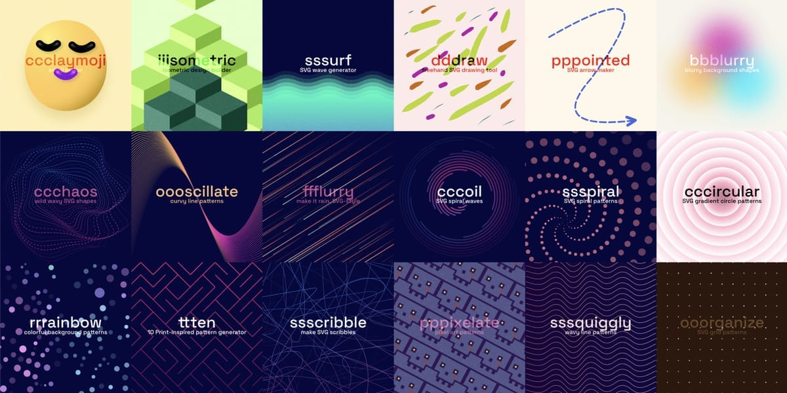
  **[fffuel](https://www.fffuel.co/)** Free\
  Small generators for gradients, noise, grain and patterns.\
  **Use when:** you need texture.

## Photos and video

Free to use under each site's own licence. Read it once per source, especially for recognisable people or brands.

- 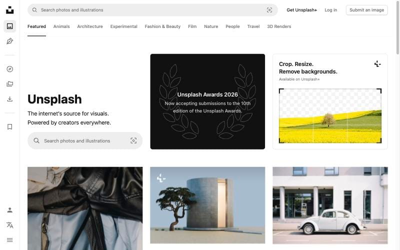
  **[Unsplash](https://unsplash.com/)** Free + paid\
  High-quality photos. Unsplash+ adds a premium library.
- 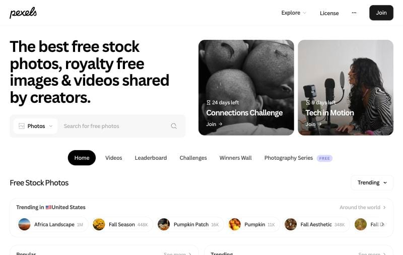
  **[Pexels](https://www.pexels.com/)** Free\
  Photos and a strong video library.
- 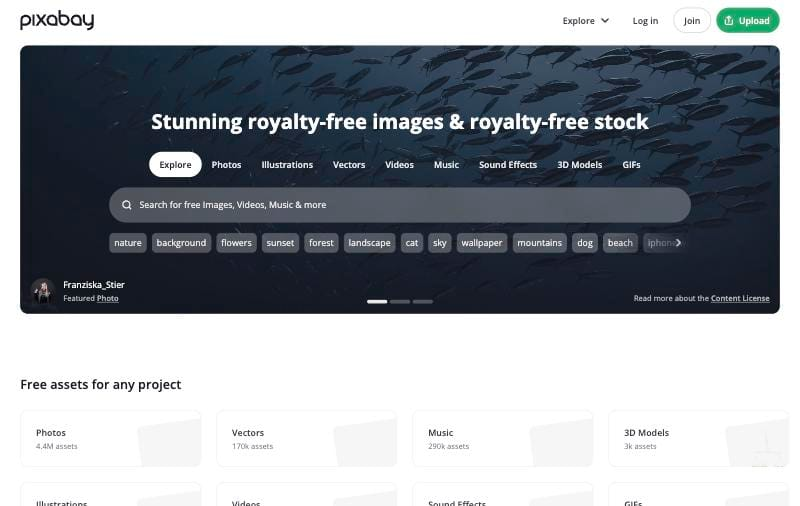
  **[Pixabay](https://pixabay.com/)** Free\
  Photos, vectors, video, music and sound effects.

## Device mockups

- 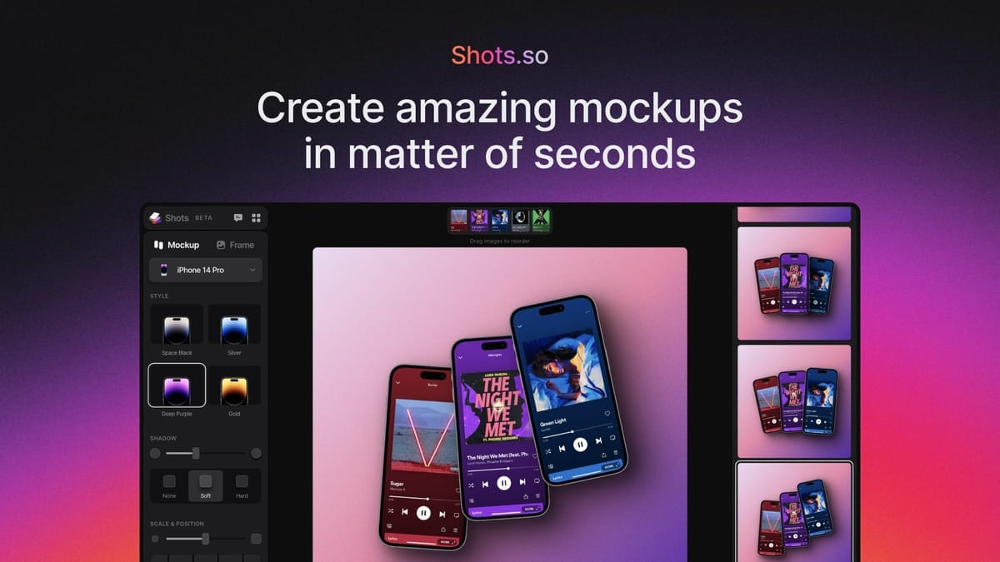
  **[Shots](https://shots.so/)** Free + paid\
  Device frames with backgrounds and shadows.\
  **Use when:** a screenshot needs to look finished.
- 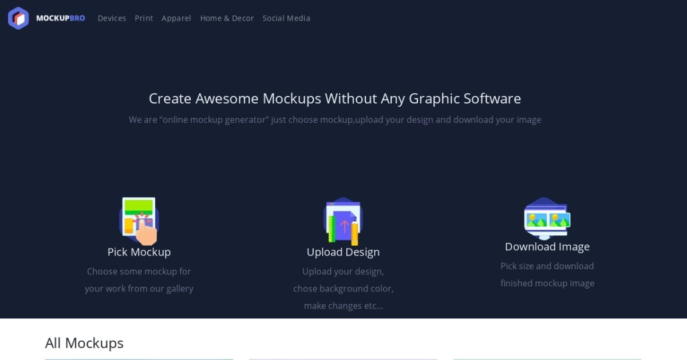
  **[MockupBro](https://mockupbro.com/)** Free\
  Product mockups beyond devices, no watermark.\
  **Use when:** you need print or packaging mockups.
- 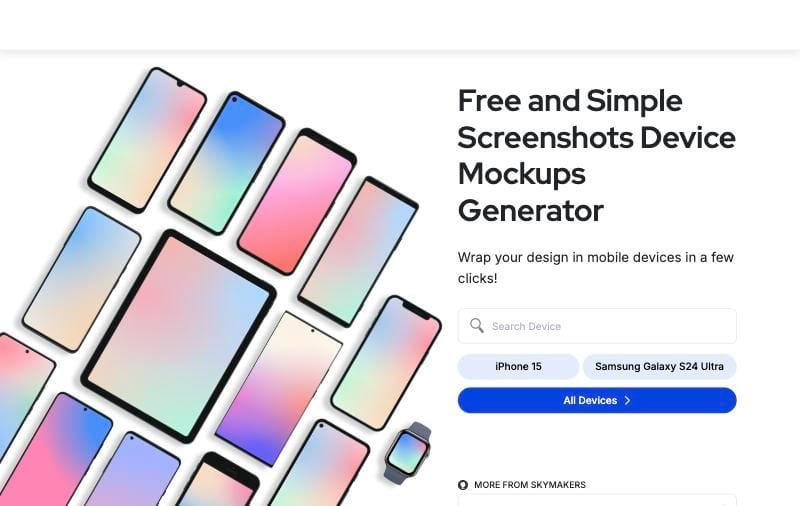
  **[MockUPhone](https://mockuphone.com/)** Free\
  Plain phone, tablet and laptop frames.\
  **Use when:** you just need a frame.

## Image processing

Compress every image before it ships. A stock hero photo is often several megabytes.

- 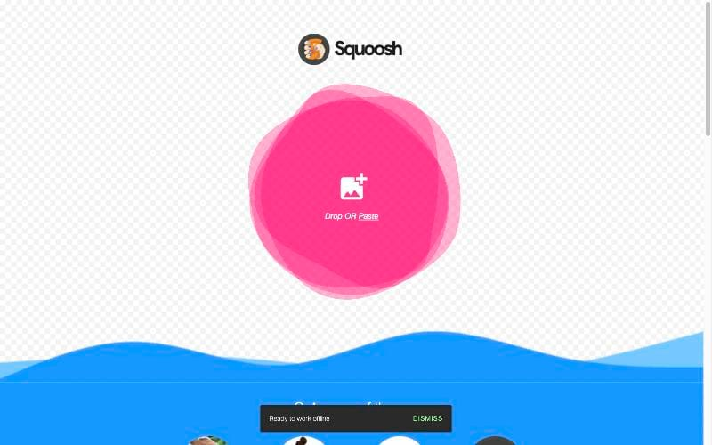
  **[Squoosh](https://squoosh.app/)** Free\
  Compress and convert in the browser. Exports AVIF and WebP.\
  **Use when:** optimising single images.
- 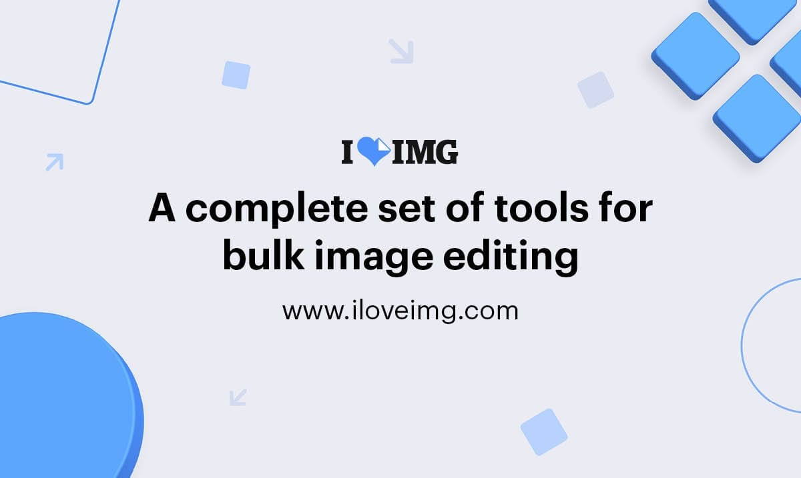
  **[iLoveIMG](https://www.iloveimg.com/)** Free + paid\
  Batch resize, crop and compress.\
  **Use when:** processing many images at once.
- 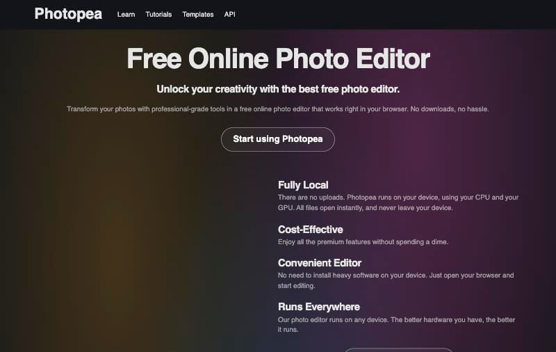
  **[Photopea](https://www.photopea.com/)** Free + paid\
  Browser photo editor that opens PSD files. Premium removes ads.\
  **Use when:** you receive a PSD and have no Photoshop.

## The short version

| Layer | Default | Price | Add when |
|---|---|---|---|
| Components | shadcn/ui | Free | A section is needed fast: shadcnblocks |
| Colour | Radix Colors | Free | Exploring brand colours: Realtime Colors |
| Type scale | Utopia | Free | A fixed scale is enough: Typescale |
| Theme | tweakcn | Free tier | |
| Icons | Lucide | Free | Multiple weights are needed: Phosphor |
| Images | Unsplash + Squoosh | Free | |

Five layers, five decisions, one source each.
