Component trả lời trang được làm từ gì. Bố cục và chuyển động trả lời cái gì nằm ở đâu, và cái gì thay đổi khi người dùng tương tác. Cách nhanh nhất để quyết tốt là xem người khác đã quyết thế nào.

Ba loại nguồn bên dưới: prompt AI cho bản nháp đầu, thư viện tham khảo, và công cụ làm chuyển động.

Nhãn giá: Miễn phí miễn phí hoàn toàn. Miễn phí + trả phí dùng miễn phí được, có gói trả phí mở thêm. Giá tính đến tháng 10/2026.

## Template và prompt cho AI

Các nguồn này bán prompt thay vì code. Dán prompt vào công cụ AI coding, công cụ đó sinh trang bằng chính stack của dự án. Kết quả là bản nháp: phải áp token, component và nội dung của mình trước khi đưa lên.

- 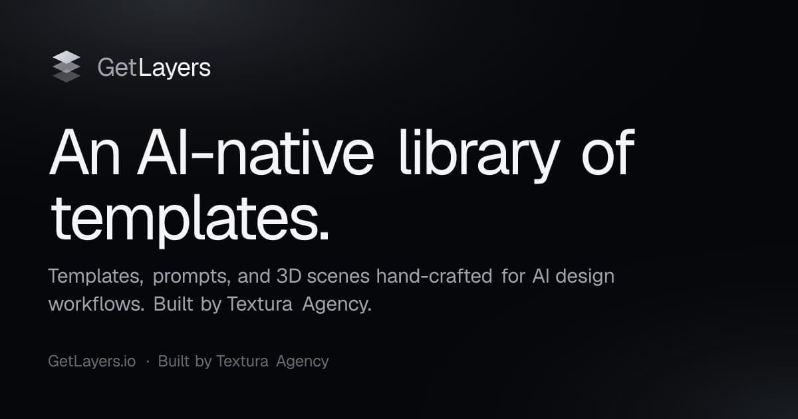
  **[Layers](https://www.getlayers.ai/)** Miễn phí + trả phí\
  Prompt cho template, section, cảnh 3D, nền và gradient. Dùng thương mại cần gói trả phí.\
  **Dùng khi:** cần một section, không phải cả trang.
- 
  **[MotionSites](https://motionsites.ai/)** Miễn phí + trả phí\
  Prompt cho nguyên landing page có chuyển động, viết cho Lovable, Bolt, Cursor và Claude.\
  **Dùng khi:** muốn bản nháp đủ cả trang.
- 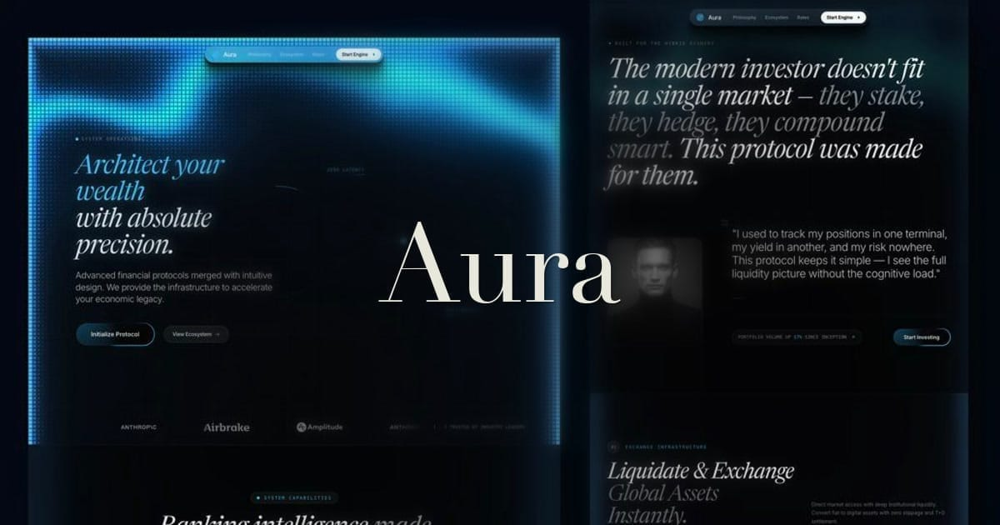
  **[Template của Aura](https://www.aura.build/templates)** Miễn phí + trả phí\
  Trang dựng trong Aura, một công cụ AI dựng website. Gói miễn phí được chỉnh và xuất HTML cho mục đích cá nhân. Prompt AI và dùng thương mại cần gói Pro (từ $12.50/tháng, trả theo năm).\
  **Dùng khi:** muốn chỉnh trực quan rồi xuất code.

**Chọn:** dùng prompt cho layout đầu tiên, rồi thay những gì nó tự bịa ra.

## Thư viện tham khảo cho landing page

Hữu ích nhất khi có sẵn một câu hỏi cụ thể ("các sản phẩm khác bày bảng giá ba gói thế nào"), ít hữu ích nhất khi lướt không mục đích.

- 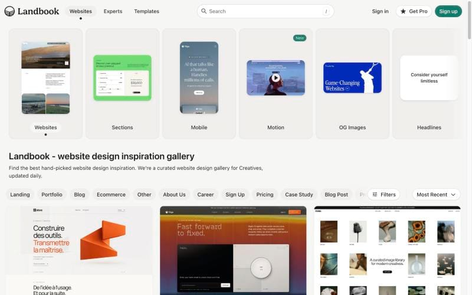
  **[Land-book](https://land-book.com/)** Miễn phí + trả phí\
  Kho lớn, lọc theo loại trang và loại section.\
  **Dùng khi:** tìm một section cụ thể.
- **[Lapa Ninja](https://www.lapa.ninja/)** Miễn phí + trả phí\
  7.300+ landing page kèm ảnh chụp toàn trang. Pro bỏ giới hạn.\
  **Dùng khi:** muốn xem nguyên trang từ trên xuống dưới.
- 
  **[Curated](https://www.curated.design/)** Miễn phí\
  Bộ nhỏ hơn, chọn tay, xếp theo ngành và phong cách.\
  **Dùng khi:** cần chất lượng hơn số lượng.
- 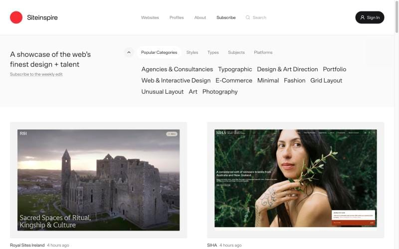
  **[siteInspire](https://www.siteinspire.com/)** Miễn phí\
  Site editorial và studio, lọc theo phong cách và chủ đề.\
  **Dùng khi:** site thiên về nội dung.
- 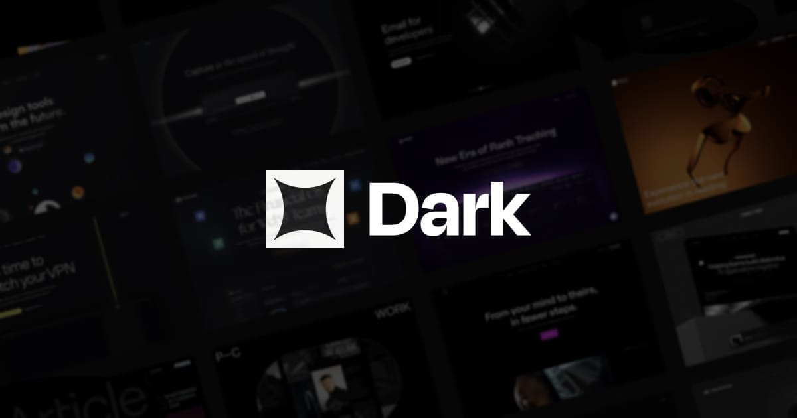
  **[Dark Design](https://www.dark.design/)** Miễn phí\
  Chỉ gồm site nền tối.\
  **Dùng khi:** thiết kế dark theme.
- 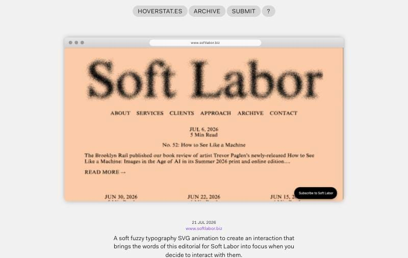
  **[Hoverstat.es](https://www.hoverstat.es/)** Miễn phí\
  Site có tương tác lạ.\
  **Dùng khi:** tìm ý tưởng, hiếm khi dùng lại trực tiếp.

## Tham khảo cho màn hình sản phẩm và các trạng thái

Landing page và UI sản phẩm là hai bài toán khác nhau. Với bản thân sản phẩm, hãy xem app thật.

- 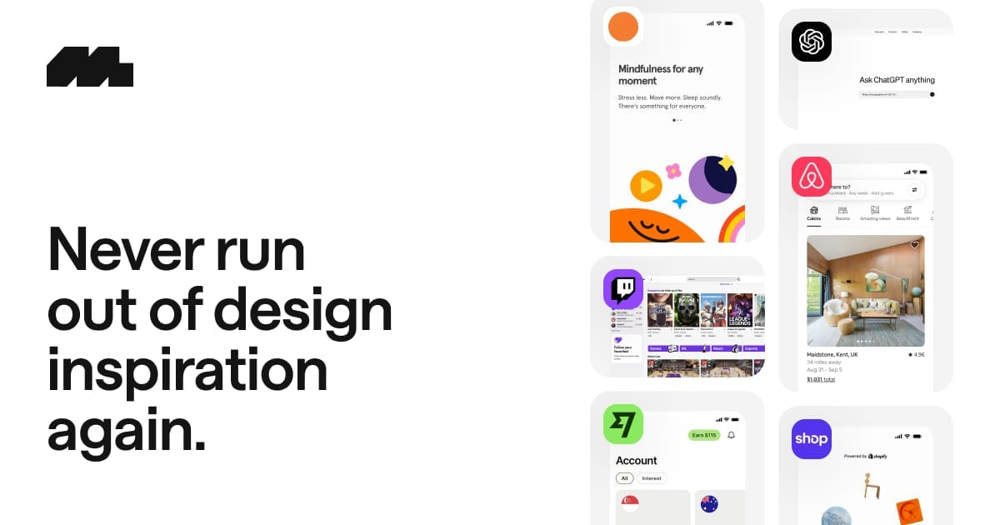
  **[Mobbin](https://mobbin.com/)** Miễn phí + trả phí\
  Màn hình và luồng hoàn chỉnh từ app iOS, Android, web đã phát hành. Gói miễn phí bị giới hạn.\
  **Dùng khi:** thiết kế một luồng như onboarding hay thanh toán.
- 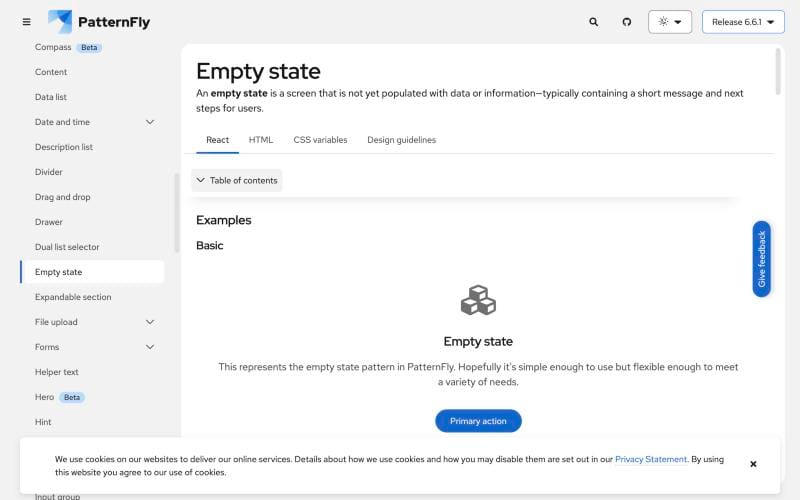
  **[Empty state của PatternFly](https://www.patternfly.org/components/empty-state/)** Miễn phí\
  Màn hình hiển thị gì khi chưa có dữ liệu: lần dùng đầu, không có kết quả, lỗi.\
  **Dùng khi:** màn hình có thể rỗng.
- 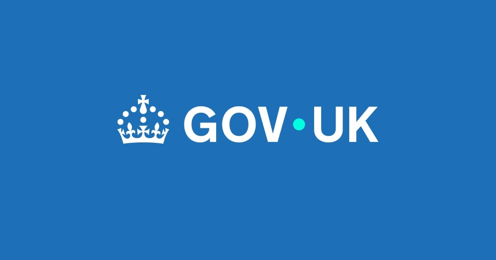
  **[Error summary của GOV.UK](https://design-system.service.gov.uk/components/error-summary/)** Miễn phí\
  Khối tóm tắt ở đầu trang, mỗi lỗi link tới đúng ô, kèm thông báo cạnh ô. Đứng sau là nghiên cứu trên một dịch vụ công quy mô lớn.\
  **Dùng khi:** thiết kế validate cho form.

Một trang chỉ có thiết kế cho đường suôn sẻ mới là một phần ba thiết kế. Trạng thái rỗng và lỗi là một phần của bố cục.

## Thư viện chuyển động

Mỗi dự án chọn một. Trước đó, xem transition, keyframe hay scroll-driven animation của CSS có làm được chưa. Cách nào cũng phải tôn trọng `prefers-reduced-motion`.

- 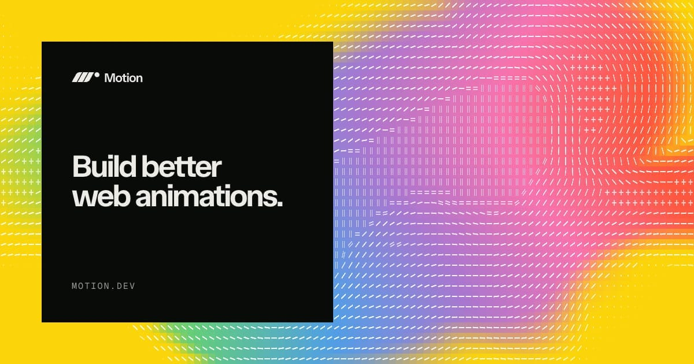
  **[Motion](https://motion.dev/)** Miễn phí + trả phí\
  Trước là Framer Motion. Animation khai báo cho React, có sẵn animation layout và lúc phần tử rời trang. Thư viện miễn phí; Motion+ thêm ví dụ premium.\
  **Dùng khi:** dự án dùng React.
- 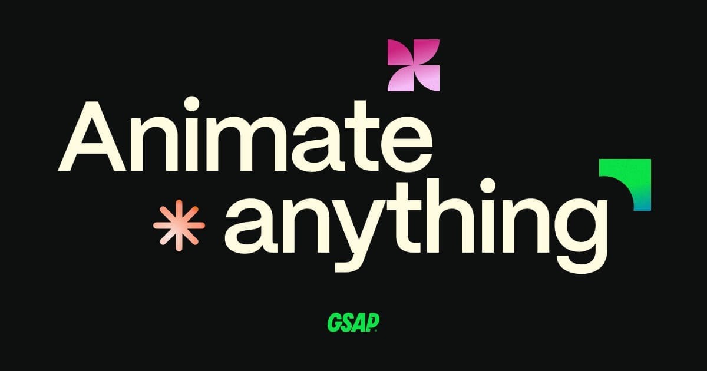
  **[GSAP](https://gsap.com/)** Miễn phí\
  Không phụ thuộc framework. Mạnh nhất ở timeline và chuỗi chuyển động theo cuộn qua ScrollTrigger. Mọi plugin nay đều miễn phí.\
  **Dùng khi:** chuyển động đi theo thao tác cuộn.
- 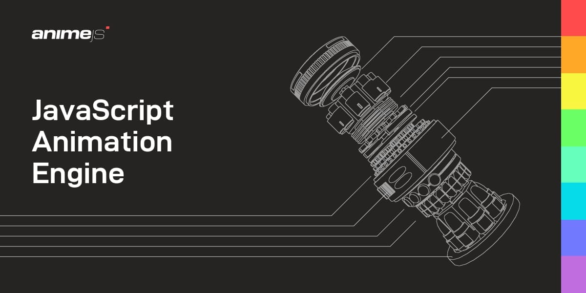
  **[Anime.js](https://animejs.com/)** Miễn phí\
  Thư viện nhẹ cho DOM, CSS và SVG.\
  **Dùng khi:** không dùng framework, cần nhẹ.

## Icon và hình động

Icon động hiệu quả nhất ở chỗ xác nhận một hành động: đã copy, đã lưu, đã gửi. Icon chuyển động không có lý do sẽ kéo sự chú ý khỏi nội dung bên cạnh.

- 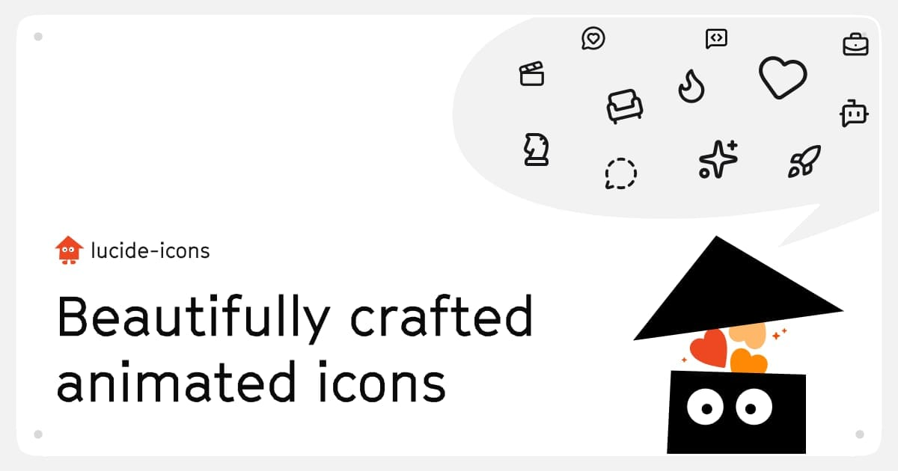
  **[lucide-animated](https://lucide-animated.com/)** Miễn phí\
  350+ icon Lucide có chuyển động cho React, dựng trên Motion, cài qua shadcn CLI.\
  **Dùng khi:** đã dùng Lucide và shadcn/ui.
- 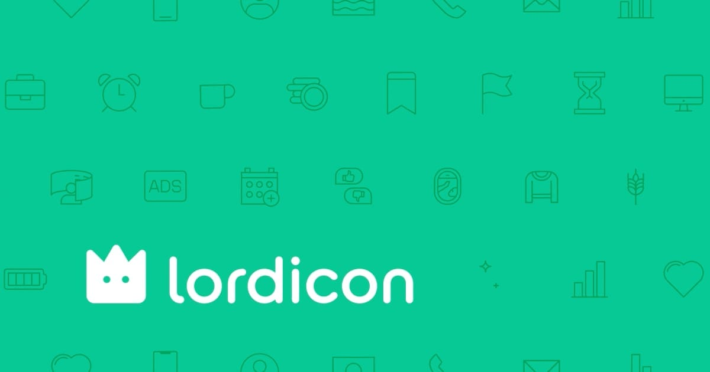
  **[Lordicon](https://lordicon.com/)** Miễn phí + trả phí\
  9.700 icon động miễn phí, phải ghi nguồn. Pro mở 38.100 icon và bỏ yêu cầu ghi nguồn.\
  **Dùng khi:** cần kích hoạt theo hover, click hay lặp.
- 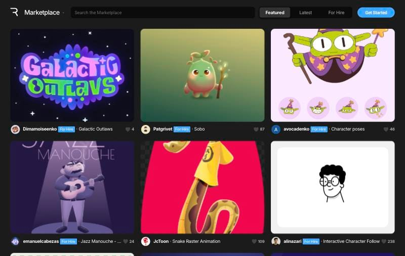
  **[Rive marketplace](https://rive.app/marketplace/)** Miễn phí + trả phí\
  Animation tương tác, phản ứng theo trạng thái. Nhiều file remix miễn phí; trình chỉnh Rive có gói trả phí.\
  **Dùng khi:** animation phải phản ứng với thao tác người dùng.

## Ví dụ và hướng dẫn

- **[CodePen](https://codepen.io/)** Miễn phí + trả phí\
  Tìm một hiệu ứng cụ thể và đọc code chạy được.\
  **Dùng khi:** biết hiệu ứng muốn có nhưng chưa biết code.
- 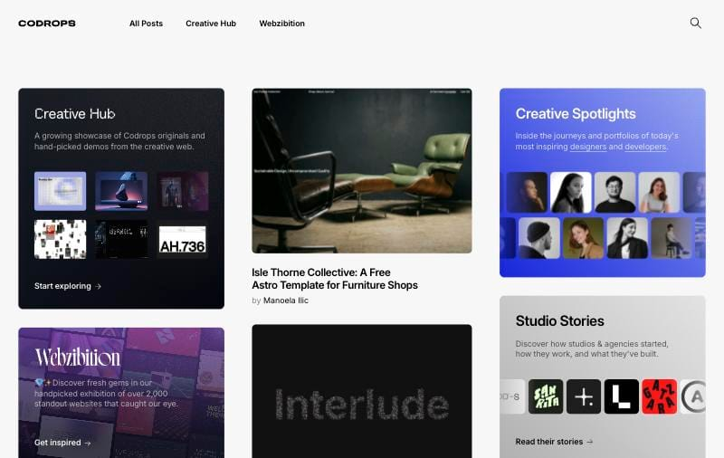
  **[Codrops](https://tympanus.net/codrops/)** Miễn phí\
  Hướng dẫn và demo chi tiết về hiệu ứng cuộn, WebGL và chữ, mã nguồn trên GitHub.\
  **Dùng khi:** muốn hiểu một hiệu ứng được dựng thế nào.

## Tóm lại

| Cần | Bắt đầu với | Giá |
|---|---|---|
| Bản nháp đầu cho landing page | MotionSites hoặc Layers | Miễn phí + trả phí |
| Tham khảo section | Land-book | Miễn phí + trả phí |
| Tham khảo luồng sản phẩm | Mobbin | Miễn phí + trả phí |
| Trạng thái rỗng và lỗi | PatternFly, GOV.UK | Miễn phí |
| Chuyển động trong React | Motion | Miễn phí |
| Chuỗi chuyển động theo cuộn | GSAP | Miễn phí |
| Icon động | lucide-animated | Miễn phí |

Tham khảo trước, rồi tới bản nháp, rồi chỉ thêm chuyển động ở chỗ nó giải thích được điều gì vừa thay đổi.
